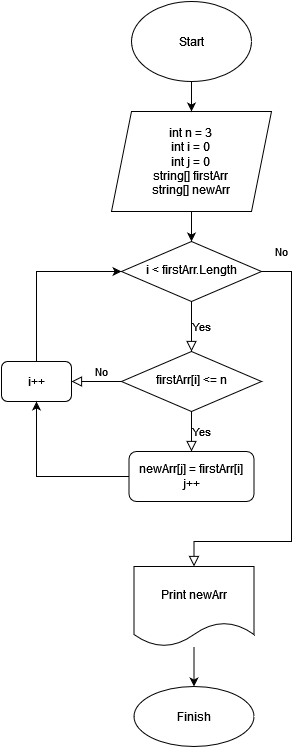

# Итоговая проверочная работа

## Задача:

Написать программу, которая из имеющегося массива строк формирует новый массив из строк, длина которых меньше, либо равна 3 символам. Первоначальный массив можно ввести с клавиатуры, либо задать на старте выполнения алгоритма. При решении не рекомендуется пользоваться коллекциями, лучше обойтись исключительно массивами.

Примеры:

*[“Hello”, “2”, “world”, “:-)”] → [“2”, “:-)”]*

*[“1234”, “1567”, “-2”, “computer science”] → [“-2”]*

*[“Russia”, “Denmark”, “Kazan”] → []*

## Алгоритм решения:
1. Создаем строковый массив и заполняем его значениями, введенными пользователем с клавиатуры через пробел.

2. Перебираем все значения массива по очереди и проверяем соответствуют они условию задачи или нет.(длина <= 3).

3. Определяем длину нового строкового массива.

4. Заполняем его элементами, удовлетворяющими условию задачи, из первого массива в новый

5. Выводим на экран новый строковый массив.

## Блок-схема алгоритма

